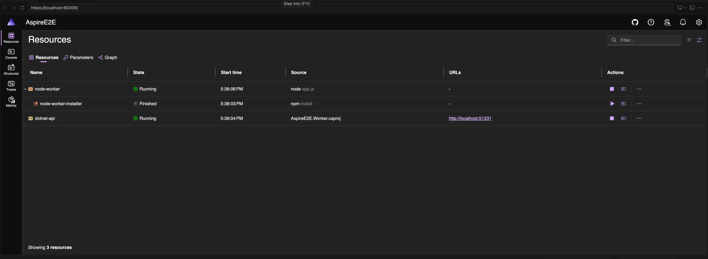

# See the whole system

The Aspire Dashboard keeps your running app in one place:

- **Resources** show what is running, waiting, or unhealthy.
- **Endpoints** take you straight to each service.
- **Logs** combine console output and structured OpenTelemetry data.
- **Traces** follow a request across service boundaries.
- **Metrics** show how the app behaves over time.

Open it from the Aspire view whenever you need to understand what your app is doing.

[Explore the Aspire Dashboard](https://aspire.dev/dashboard/overview/)
