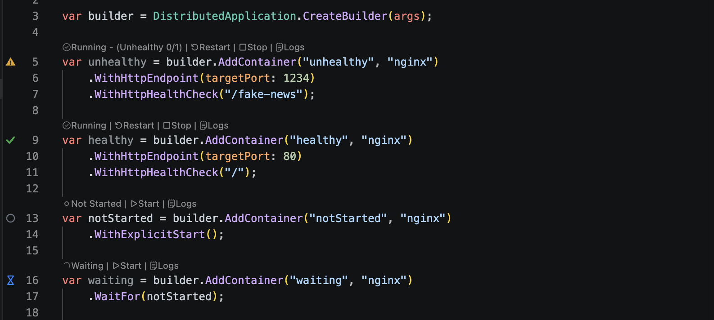

# Press F5

Choose your AppHost and press **F5**, or use **Run AppHost** or **Debug AppHost** from the Aspire view.

Aspire starts every resource in dependency order. In debug mode, the extension also connects supported VS Code debuggers so breakpoints work across your app.

While the app runs, your AppHost shows live resource state and quick actions for logs, restart, stop, and start.

[Learn more about the Aspire extension](https://aspire.dev/get-started/aspire-vscode-extension/)
